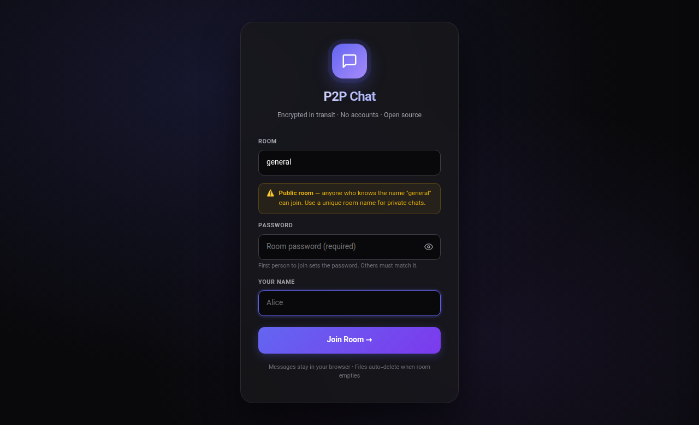
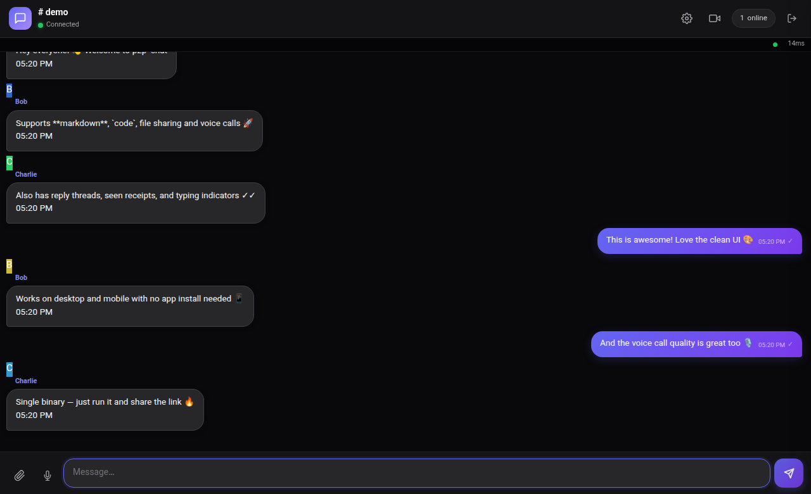
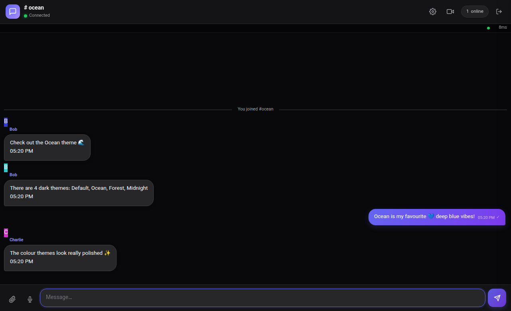
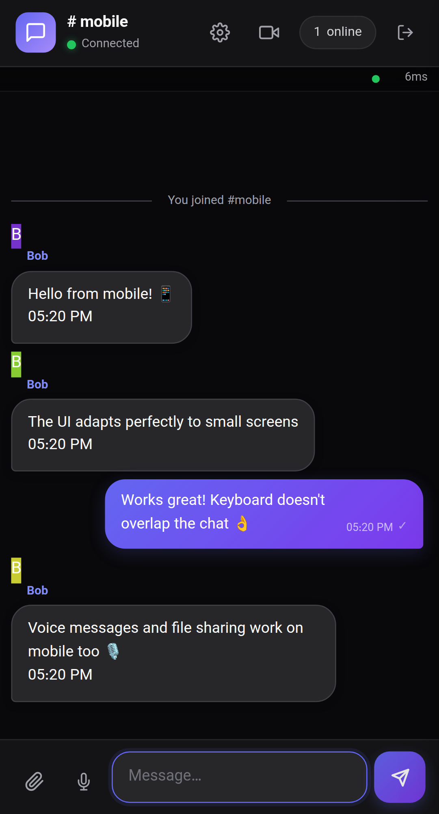
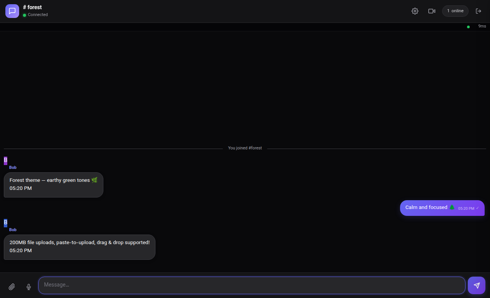
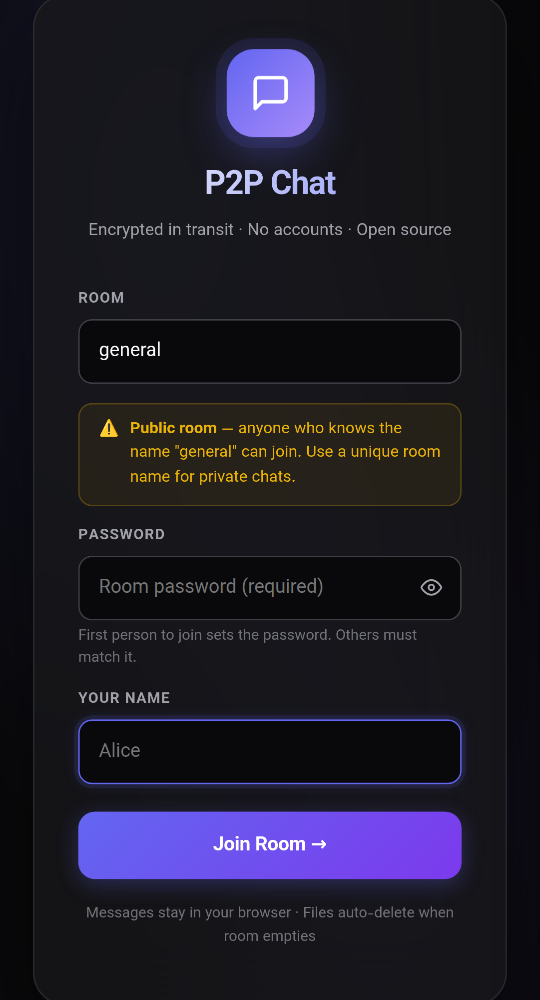

# 💬 P2P Chat

A fast, privacy-friendly group chat — distributed as a **single self-contained binary**. No accounts, no database, no Docker. Just run it and share the link.


---

## 📸 Screenshots

<table>
  <tr>
    <td></td>
    <td></td>
  </tr>
  <tr>
    <td align="center"><em>Join screen</em></td>
    <td align="center"><em>Chat room — Default dark theme</em></td>
  </tr>
  <tr>
    <td></td>
    <td></td>
  </tr>
  <tr>
    <td align="center"><em>Ocean colour theme</em></td>
    <td align="center"><em>Mobile responsive UI</em></td>
  </tr>
  <tr>
    <td></td>
    <td></td>
  </tr>
  <tr>
    <td align="center"><em>Forest colour theme</em></td>
    <td align="center"><em>Join screen on mobile</em></td>
  </tr>
</table>

---

## ✨ Features

### 💬 Messaging
- Real-time WebSocket messaging
- Markdown rendering (bold, italic, code blocks with syntax highlighting)
- Reply to any message (swipe right on mobile / hover button on desktop)
- Edit sent messages
- Admin delete-for-everyone
- Message select mode (long-press)

### 📎 File Sharing
- Send images, video, audio, documents — up to **200 MB** per file
- Inline image previews with lightbox zoom & pan
- Inline video player
- Paste-to-upload (Ctrl+V)
- Drag-and-drop upload

### 🎵 Audio & Voice
- **Voice messages** — record in-browser, instant send
- **Music file player** — XHR download with circular progress ring before playback
- **Voice messages** — same download-first experience; tap ✕ to cancel mid-download
- Auto-play next voice message when current one ends
- Now-playing bar with seek track and sender info
- Seek bar with touch support on mobile

### 📞 Voice & Video Calls
- Multi-user WebRTC voice calls (DTLS-SRTP encrypted, peer-to-peer)
- Screen share
- Flip camera
- Mute / leave call controls
- PiP (picture-in-picture) video overlay

### 👥 User Experience
- Seen-by avatars below messages (coloured initials as each peer reads)
- Typing indicators with animated dots
- User status (online / offline)
- User-agent badges (Android / iOS / macOS / Windows)
- User details popup
- Scroll-to-new button with unread count badge
- Sent sound, connection-lost beep
- Auto-reconnect popup on disconnect

### 🎨 Themes & UI
- **4 dark themes:** Default, Ocean, Forest, Midnight
- Frosted glass design language
- Responsive — works on desktop and mobile browsers
- Service Worker for offline support & instant reload on update

### 🔒 Rooms & Security
- Password-protected rooms
- Room destroyed when last member leaves
- Files auto-deleted when room empties
- Transport encrypted over `wss://` (TLS)
- No accounts — join with just a name and room password

### 🌐 Deployment
- Single binary, no dependencies
- Works at `/` (root domain) or `/chat/` (sub-path) behind Nginx
- Configurable port via `-p` flag or `$PORT` env var
- Nginx prefix auto-detected in JavaScript

---

## 🚀 Quick Start

```bash
# Download (Linux x86_64)
curl -L https://github.com/BarzinJarvis/p2p-chat/releases/latest/download/chat-linux-amd64 -o p2p-chat
chmod +x p2p-chat
./p2p-chat -p 8080
```

Open `http://localhost:8080` — enter a room name + password + your name and join.

### Build from source

```bash
git clone https://github.com/BarzinJarvis/p2p-chat
cd p2p-chat
go build -o p2p-chat .
./p2p-chat -p 8080
```

**Requires:** Go 1.22+

---

## ⚙️ CLI Options

```
./p2p-chat [OPTIONS]

  -p PORT    Listen port (default 8080, overrides $PORT)
```

---

## 🌐 Nginx Reverse Proxy

### Root domain (`https://chat.example.com`)

```nginx
server {
    listen 443 ssl;
    server_name chat.example.com;

    ssl_certificate     /etc/letsencrypt/live/example.com/fullchain.pem;
    ssl_certificate_key /etc/letsencrypt/live/example.com/privkey.pem;

    client_max_body_size 200m;

    location /ws {
        proxy_pass http://127.0.0.1:8080;
        proxy_http_version 1.1;
        proxy_set_header Upgrade    $http_upgrade;
        proxy_set_header Connection "upgrade";
        proxy_read_timeout 86400;
    }

    location / {
        proxy_pass http://127.0.0.1:8080;
        proxy_set_header Host      $host;
        proxy_set_header X-Real-IP $remote_addr;
    }
}
```

### Sub-path (`https://example.com/chat/`)

```nginx
location /chat/ws {
    proxy_pass http://127.0.0.1:8080/ws;
    proxy_http_version 1.1;
    proxy_set_header Upgrade    $http_upgrade;
    proxy_set_header Connection "upgrade";
    proxy_read_timeout 86400;
}

location /chat/ {
    proxy_pass http://127.0.0.1:8080/;
    proxy_set_header Host      $host;
    proxy_set_header X-Real-IP $remote_addr;
}
```

---

## 🔒 Security Notes

- **In transit:** All traffic over `wss://` is TLS encrypted — ISPs cannot read messages
- **Server relay:** Text messages pass through the server (not E2E encrypted). The server operator can read messages in transit.
- **Voice/Video:** WebRTC is DTLS-SRTP peer-to-peer — server never handles audio/video
- **Rooms:** Anyone with the room name + password can join. Use a private room name and strong password for sensitive chats.

---

## 📁 Project Structure

```
p2p-chat/
├── main.go           # HTTP server, /upload, file serving, /uploads/ handler
├── hub.go            # WebSocket hub, room management, file cleanup
├── go.mod / go.sum
└── static/
    ├── index.html    # Full SPA — embedded in binary at build time
    └── sw.js         # Service Worker (offline + cache busting)
```

---

## 📜 License

MIT — free to use, modify, and distribute.
